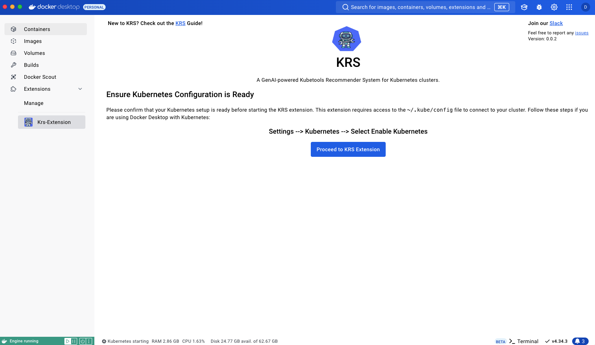
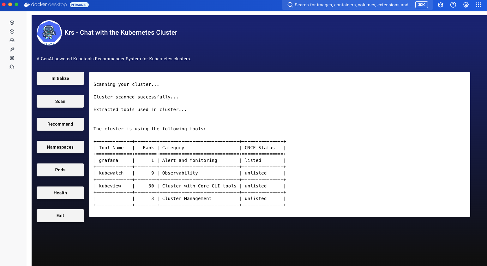
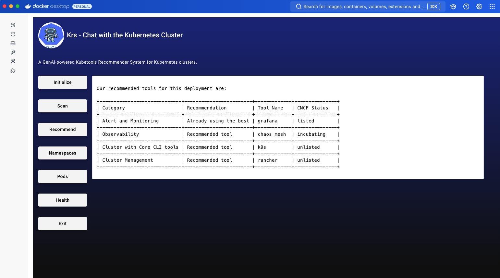
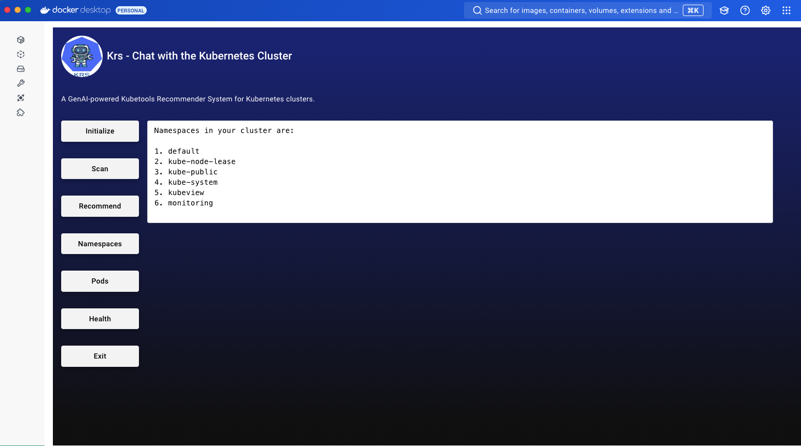
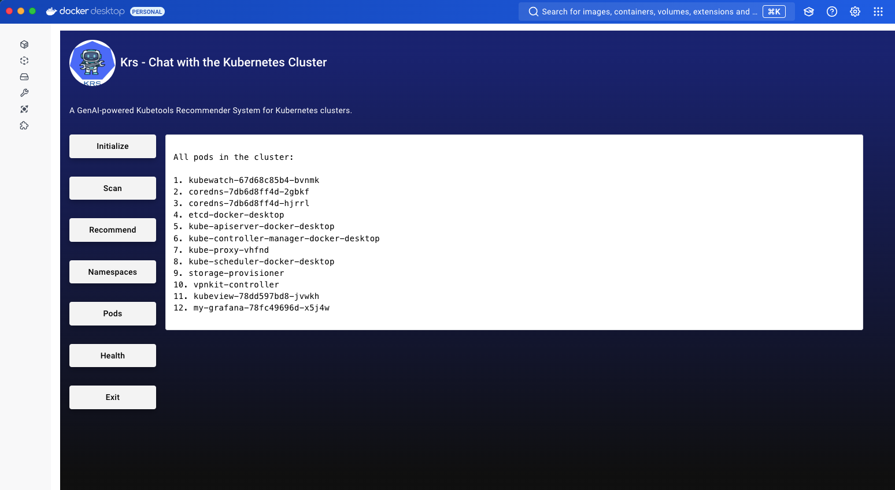
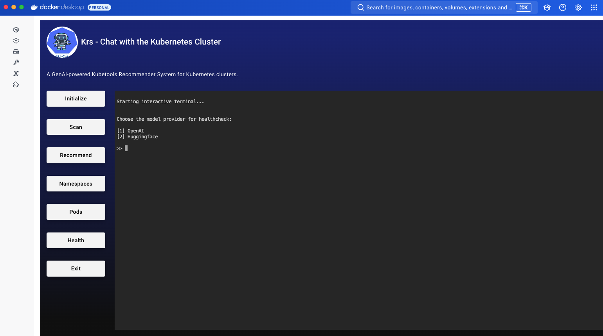

# Krs Extension for Docker Desktop


## Overview

This project is a Docker Desktop extension for KRS(Kubetools Recommender System) - a Gen-AI powered tool designed to recommend and manage tools for Kubernetes clusters. The extension provides a user-friendly interface for Kubernetes cluster operations such as initialization, scanning, recommendation, and healthcheck for tools, with support for different Kubernetes environments.

## Table of Contents

1. [Requirements](#requirements)
2. [Build and Install the Docker Extension](#build-and-install-the-docker-extension)
3. [Debug the Docker Extension](#debug-the-docker-extension)
4. [Dockerfile Explanation](#dockerfile-explanation)
5. [User Interface (UI)](#user-interface-ui)
6. [Running the KRS Commands](#running-the-krs-commands)
7. [Handling Kubernetes Configurations](#handling-kubernetes-configurations)
8. [Handling Additional Configuration Requirements for Different Kubernetes Clusters](#handling-additional-configuration-requirements-for-different-kubernetes-clusters)

## Prerequisite

Before you begin, ensure you have the following installed:
- **Docker Desktop** (for building and running Docker Desktop extensions)
- Enable Kubernetes 
- **Node.js**
- **Go**
- **Python**

## Enabling Kubernetes on Docker Dashboard

Before you install the Krs Docker Extension, ensure that Kubernetes is enabled using Docker Desktop. 
Don't forget to select the "Show System containers" option under Docker Desktop > Settings > Kubernetes.


## Build and Install the Docker Extension

### Step 1: Build the Extension
In the project root, run the following commands to build the extension:

```bash
make build-extension
```

### Step 2: Install the Extension in Docker Desktop
You can install the built extension using Docker Desktop's command-line interface:

```bash
make install-extension
```

After installation, you will see the KRS - Kubetools Recommender System extension under Docker Desktop's Extensions tab.

### Additional Step: Update the Extension in Docker Desktop
Whenever you make a change to your extension, you only need to hit the following command. It will help you rebuild the extension and update it:

```bash
make update-extension
```

## Debug the Docker Extension

### Step 1: Debug the Extension
In the project root, run the following commands to debug the extension:

```bash
make debug-extension
```

### Step 2: Reset the debug mode
You can turn off the debug mode by hitting this below command

```bash
make reset-extension
```


## Dockerfile Explanation 

The [Dockerfile](https://github.com/kubetoolsca/krs-dockerx/blob/add-krs-extension/Dockerfile) is divided into three main stages:

### Stage 1: Backend Service (Go)
- **Base Image**: golang:1.21-alpine
- This stage builds the backend service from the Go source files.

### Stage 2: Frontend (UI)

- **Base Image**: node:21.6-alpine
- This stage builds the frontend UI using Node.js.

### Stage 3: KRS (Python)

- **Base Image**: python:3.12.5-alpine
- This stage sets up the KRS tool, installs required dependencies, and prepares the service to interact with Kubernetes.

## User Interface (UI)

The Docker extension provides a graphical user interface (GUI) that allows users to initialize the Kubernetes environment and run various KRS commands.

- **React-based Frontend**: The UI is built using React and Material-UI.
- **Buttons** so far:
    - ``krs init``: Initializes the services and loads the scanner. (**WORKING**) ✅
    - ``krs scan``: Scans the cluster and extracts a list of tools that are currently used. (**WORKING**) ✅
    - ``krs recommend``: Generates a table of recommended tools from our ranking database and their CNCF project status. (**WORKING**) ✅
    - ``krs namespaces``: Lists all the namespaces. (**WORKING**) ✅
    - ``krs pods``: Lists all the pods with namespaces, or lists pods under a specified namespace. (**WORKING**) ✅
    - ``krs health``: Starts an interactive terminal using an LLM of your choice to detect and fix issues with your cluster. (**WORKING**) ✅
    - ``krs exit``: Ends krs services safely and deletes all state files from system. Removes all cached data. (**WORKING**) ✅

## Running the KRS Commands
### Step 1: Starting the KRS-EXTENSION Container

The `krs` commands are executed inside a Docker container. This container is started in detached mode and can run commands via exec:

``` typescript 
export const startKrsContainer = async (ddClient: v1.DockerDesktopClient) => {
  // Start container in detached mode with kube config mounted
};
```


### Step 2: Running the ``krs init`` Command


This command initializes the services and loads the scanner.

``` typescript 
export const initKRS = async (ddClient: v1.DockerDesktopClient) => {
  // Ensure the container is running, and execute "krs init" inside the container
};
```

### Step 3: Running the ``krs scan`` Command

This command scans the cluster and extracts a list of tools that are currently used.

``` typescript 
export const krsScan = async (ddClient: v1.DockerDesktopClient) => {
  // Ensure the container is running, and execute "krs scan" inside the container
};
```

### Step 4: Running the ``krs recommend`` Command

This command scans the cluster and generates a table of recommended tools from our ranking database and their CNCF project status.
``` typescript 
export const krsRecommend = async (ddClient: v1.DockerDesktopClient) => {
  // Ensure the container is running, and execute "krs scan" inside the container
};
```

### Step 5: Running the ``krs namespaces`` Command

This command lists all the namespaces.
``` typescript 
export const krsNamespaces = async (ddClient: v1.DockerDesktopClient) => {
  // Ensure the container is running, and execute "krs scan" inside the container
};
```

### Step 5: Running the ``krs pods`` Command

This command lists all the pods with namespaces, or lists pods under a specified namespace.
``` typescript 
export const krsPods = async (ddClient: v1.DockerDesktopClient) => {
  // Ensure the container is running, and execute "krs scan" inside the container
};
```

### Step 6: Running the ``krs health`` Command

This command starts an interactive terminal using an LLM of your choice to detect and fix issues with your cluster.
``` typescript 
export const krsHealth = async (ddClient: v1.DockerDesktopClient) => {
  // Ensure the container is running, and execute "krs scan" inside the container
};
```

This command will allow you to interact with your cluster.

### Step 7: Running the ``krs exit`` Command

This command ends krs services safely and deletes all state files from system. Removes all cached data.

``` typescript 
export const krsExit = async (ddClient: v1.DockerDesktopClient) => {
  // Ensure the container is running, and execute "krs scan" inside the container
};
```

## Handling Kubernetes Configurations
The Docker extension dynamically handles various Kubernetes configurations by mounting the `~/.kube/config` file from the host system into the container. This file contains the necessary configurations to connect to the local Kubernetes clusters.

## Handling Additional Configuration Requirements for Different Kubernetes Clusters
Different Kubernetes clusters may require additional configuration, such as specific authentication methods or additional certificate files. 


